# StudioSync HITL: Model-Agnostic LLM Studio Alignment Engine

A **multi-tier LLM system** for evaluating and scoring TV Series pitches vs. multiple studio reference docs with **model-agnostic prompt engineering, output parsing, error handling, dashboard display, batch processing, and human-in-the-loop integration**. Local models run in a **contained ecosystem** to protect **proprietary data**, **intellectual property**, and **business processes**.

---

## Batch Options - 10 Model x 10 Pitch x 3 Studio Mandate x 8 Adjustable Section Weights

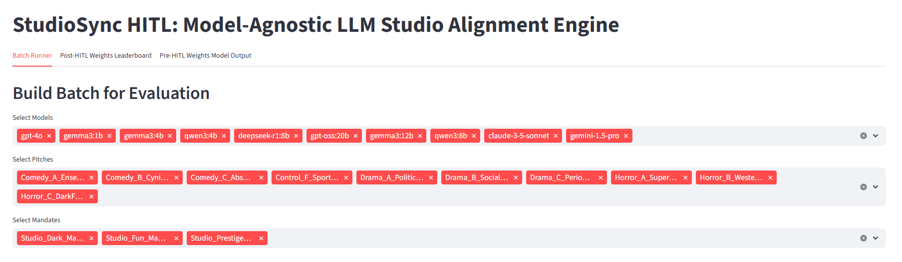

---

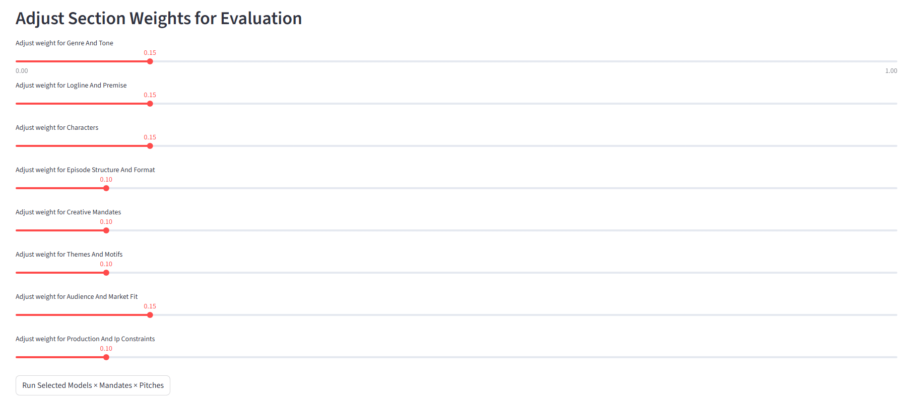

---

## Executive Summary

**StudioSync** is a model-agnostic, multi-rubric evaluation system designed to evaluate TV show pitches against specific studio mandates. The system provides granular scoring of genre, tone, target audience, and production requirements informed by reference documents. Appropriate for automating "first reads" or routing pitches to specific studios where business needs align. 

This demo showcases the system running a batch of 10 pitches across 3 distinct mandates, highlighting the system's raw structured scoring output and the final leaderboard after apply human-adjustable section weighting. The system integrates powerful cloud-based models like GPT, Gemini, and Claude. It also includes local instances (Qwen) for contained, data secure systems and processes.

**Conclusion:** Even a smaller local model like **Qwen3:8b** can achieve **exceptional performance** on highly complex tasks **(combining objective quantitative metrics, subjective qualitative metrics, dense rubric evaluation)** with appropriate **prompt engineering, document formatting, error handling, RAG, parsing, and system engineering**.  

---

## Generalizability

Highly Generalizable to other sectors where **priority alignment** or **resource allocation** is key, including:

- **Legal Documents**
- **Healthcare Operations**
- **Marketing Campaigns**
- **Business Proposals** 
- **Brand Communication Guidelines**
- **Organization Policies**
- **Manufacturing Processes**
- **Team-building & Skills Coverage**

---

## System Overview

- **Multi-model inference:** Run evaluations using **10+ local (Qwen3, GPT-OSS, Gemma, DeepSeek)** and **cloud-based LLMs (GPT-4+, Gemini, Claude)**.
- **Structured rubric scoring:** Each pitch is evaluated on 8 distinct categories, scored from 1–10 with a text justification, raw model output is JSON/CSV parsed, and a final score is achieved after apply human-adjustable section weights.
- **Mandate–pitch alignment:** Evaluate pitch alignment using varied studio mandates (low-budget comedy, mid-budget horror, high-budget drama) with granular requirements in tone, target audience, runtime, casting, production timeline, themes, content sensitivity, and more.
- **Weighted score aggregation:** Allow flexible weight adjustments to prioritize certain categories over others with easy adjustment sliders.
- **Batch processing + leaderboard output:** Efficiently process multiple pitches in batches and rank them according to their alignment with multiple mandates for comparison.
- **Streamlit HITL interface:** Enable building batches (select models, pitches, mandates), human-in-the-loop (HITL) weight adjustments, and display for transparent raw model output vs. final aggregate leaderboard scoring.
- **Full Workflow**: Inputs (model + pitches + mandates + section weights) -> Batch Inference -> Model Output -> JSON Parsing -> Weight Application -> CSV Parsing -> Ranking -> Final Leaderboard.

---

## Results

Performance for Qwen3:8 **far exceeds expectations**. This exceptional performance, for a relatively small model, is likely due to **prompt engineering, error handling, document formatting, RAG, parsing, and system engineering**. Qwen3:8 was expected to be the system's **bottom tier performer** compared to cloud-based models 100 times its size, like GPT. To see more divergence in performance, a ~4b local model (Qwen, or Mistral or Llama) will need to be tested as a **bottom tier performer**.

- A, B, and C pitches are appropriately ranked relative to each studio's priorities. **Nothing is out of order.**
- **Pitch: Control_F_Sport_Academia** is appropriately ranked very low for all three studios.
- Text justifications provide excellent context and **reference relevant studio mandate sections specifically**.
- **Objective quantitative metrics** (Budget, Production Timeline, Episode Count, Episode Length, Primary Cast Size, etc.) are **referenced and judged accurately**, with one minor exception out of 30 inferences. This could potentially be remedied by revisiting prompt engineering or doc structure.
- **Subjective qualitative metrics** (Sub-Genre, Cross-Genre, Tone, Style Influences, Premise, Themes, etc.) are **referenced and judged accurately**, though not penalized harshly enough in some cases. This could potentially be remedied by revisiting prompt engineering or doc structure.
- Even more interesting, the evaluation of misaligned genre pitches (Comedy Pitch vs Horror Studio Mandate, et al.) is **nuanced and accurate**. Studio Prestige (Drama) and Studio Dark (Horror) have no interest in formulaic comedy pitches, even if well-constructed. **Scoring here is highly appropriate**.
- Likewise, Studio Prestige (Drama) and Studio Dark (Horror) have many **overlapping priorities** (darker tone, strong themes, symbolism, world-building, etc.). It is **perfectly appropriate** that **Pitch: Horror_B_Western_Rock_Opera (a highly original experimental premise with a unique artistic vision)** scores highly with both **Studio Dark** (for horror mythos, originality, world-building, strong themes, budget, etc.) and **Studio Prestige** (for originality, world-building, strong themes, experimental storytelling, unique artistic vision, etc.).
- Further, **Pitch: Horror_C_DarkFantasy_Adventure (a wide genre mashup of horror, adventure, action, fantasy, and comedy)** is the highest-scoring non-comedy pitch with **Studio Fun**. This is also **perfectly appropriate** because this pitch contains the most comedy beats outside of the three dedicated comedy pitches.   

---

## Document Design

The pitch set consists of 10 high-quality pitches, carefully designed to isolate alignment with specific mandates rather than overall quality. 

No pitch is "bad" (except maybe Control_F), but each is designed to adhere to a specific genre/sub-genre. Each is well-defined and many are experimental, odd genre mashups, or niche. This creates **one perfect fit per studio** (A-Tier), **two curve balls per studio** that intentionally violate key studio priorities (B-Tier and C-Tier), and one **universal control pitch** that no studio should be interested in for any reason. 

Each pitch is evaluated across 3 distinct studio mandates with highly divergent priorities and tolerances.

  
**Studio Mandate Summaries (Click to Expand)**

The pitch set consists of 10 high-quality pitches, carefully designed to isolate alignment with specific mandates rather than overall quality. Each pitch is evaluated across 3 distinct studio mandates with highly divergent priorities and tolerances.

| Studio     | Base Genre      | Budget Category | Production Timeline | Episode Length | Season Length | Additional Priorities |
| ---------- | --------------- | --------------- | --------------- | ------------ | ------------ | ------------ |
| Studio Dark     | Horror      | Mid             | Mid | Mid | Short | No comedy-horror, slasher, gorefest, monster of the week, or true story human exploitation; Rich world-building & mythology; horror-aligned themes & symbolism |
| Studio Fun      | Comedy       | Low             | Fast | Short | Long | Formulaic episode structure; merchandising opportunities; minimal sets; character-driven humor; repeatable gags; younger audience |
| Studio Prestige | Drama        | High            | Slow | Long | Mid | Open to cross-genre; experimental over formulaic; character depth; cinematic quality; A-list talent required; older audience |

---

**Pitch Summaries (Click to Expand)**

Pitches are evaluated for **studio alignment**, not overall quality. No pitch is "bad" (except maybe Control_F), but each is designed to adhere to a specific genre/sub-genre. Each is well-defined and many are experimental, odd genre mashups, or niche. This creates one perfect fit per studio (A-Tier), curve balls that intentionally violate key studio priorities (B-Tier and C-Tier), and one **universal control pitch** that no studio should be interested in for any reason. 

| Pitch Name | Sub-Genre           | Title          | Summary/Logline |
| ---------- | --------------- | ------------- | --------------- |
| Comedy_A   | Ensemble Sitcom | Gigged Out    | Six gig-workers with dubious skills, all strangers, pool their resources to lease a shared office space but are mistaken for a legit consulting firm. **The Office** meets **Three's Company** with more incompetence. |
| Comedy_B   | Cynical Mockumentary | Benchford University  | Six professors at a low prestige university enact schemes to improve their lives while scheming to prevent each other from improving their lives. **Parks & Recreation** meets **A.P. Bio** with a card battling system. |
| Comedy_C   | Absurdist Animation   | The Breakfast Brigade  | The "Breakfast Brigade", an international paramilitary team of anthropomorphic breakfast foods, fight to protect breakfast from the villainous group, "The Process". **G.I. Joe** meets **Archer** with more food puns. |
| Control_F  | Sport Academia        | Grains of Truth: Competitive Sand Counting | A sincere attempt to capture the niche academic sport of competitive sand counting as never seen before on TV. **C-Span** meets **Dry Instructional Films** with coarse, rough, irritating sand that gets everywhere. | 
| Drama_A    | Political Thriller    | Wolf Mountain Divide | A retired city lawyer, now mayor of a remote Appalachian town, reawakens her ambition when a corporation sets their sights on her domain. **Succession** meets **Yellowstone** with Kathy Bates and Toby Maguire. |
| Drama_B    | Social Realism Dance           | Westville Backup | Three third-tier backup dancers support each other while working mundane day jobs, striving for the chance to catch an occasional glimpse of the spotlight. **Fame** meets **Euphoria** with more duality. |
| Drama_C    | Period Crime Romance          | Bluefield Cycle    | In the 90s, a failed competitive cyclist and her mechanic boyfriend embark on a thrilling crime spree, with a predictably tragic resolution. **The Basketball Diaries** meets **Halt and Catch Fire** with cycling crimes. |
| Horror_A   | Supernatural Psychological     | Bastion on the Endless Sea | The crew of a fishing vessel, lost at sea, find themselves adrift in a liminal space where they encounter ghosts of the past and maritime myths. **The Terror** meets **Lost** with descent into maritime madness. |
| Horror_B   | Western Rock Opera        | Cleave Land: A Post-Apocalyptic Rock Opera | Daisy and her companions brave raiders, monsters, and the post-apocalyptic Dust Bowl to reach the fabled Great Lakes and civilization. **Bone Tomahawk** meets **Fallout** with Ferrymen slinging power ballads. |
| Horror_C   | Dark Fantasy Adventure | Carter vs. the Black Plague  | Carter and his band of righteous outlaws defy the odds, and the law, to distribute a cure across a medieval world plagued by monsters and corruption. **Robin Hood** meets **Ash vs. Evil Dead** with a road-trip vibe. |

---

## Batch Run & Leaderboard Results - Qwen3:8b - 3 Mandates - 10 Pitches - Default Section Weights

Processing this batch **(1 model x 3 mandate x 10 pitches x default section weights)** takes **~7 minutes** on **modest hardware (single RTX 4080 GPU/16 GB VRAM**). It produces **3 CSV files**, one for each **1 model x 1 mandate x 10 pitch** grouping, for comparative display. It also generates **30 separate JSON files** **(1 model x 1 mandate x 1 pitch)** of raw model scores and text justifications, pre-HITL weighting, for display and full transparency. 

---

  
**Visuals - Batch Builder, HITL Weights, and Leaderboard Results (Click to Expand)**

  
### Batch Builder

Build a batch with any combination of models, mandates, pitches, and section weights.

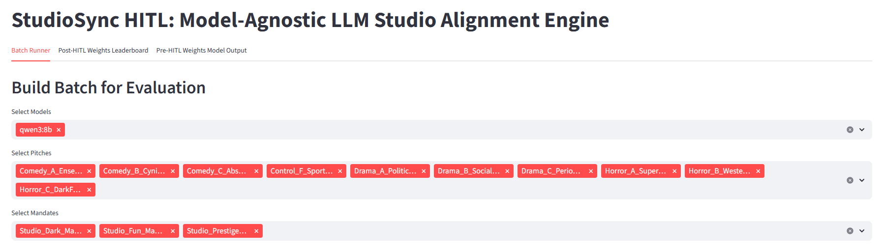

---

### HITL Weights

Fully adjustable section weighting via sliders.

---

### Leaderboard Results

Clear display of pitch rankings for every model x mandate pairing with HITL section weights applied to raw model output.

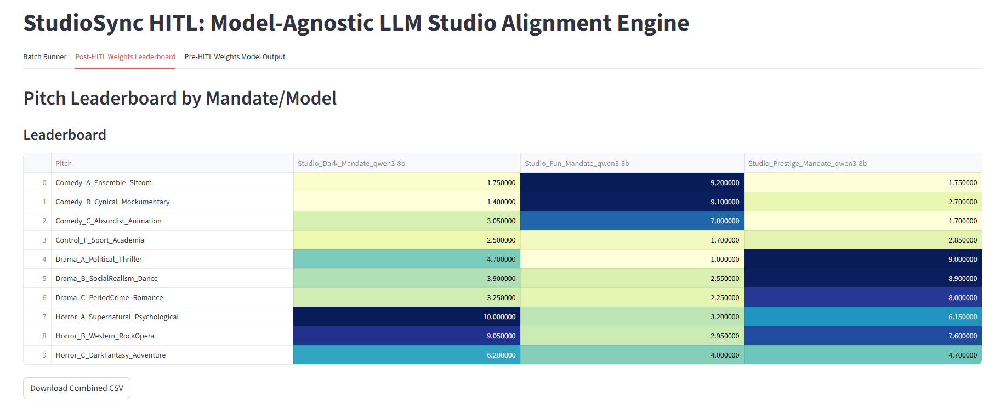

---

## Raw Model Output with Scoring Justification

Raw model output is parsed into JSON and saved before applying HITL weights. These files can be retrieved for easy human-readable display within the dashboard. The default token limit for a model's raw scoring and text justifications is 512 tokens, but this can be adjusted. A smaller token limit can speed up batch processing considerably if the user does not need the section-by-section text justifications. A larger token limit can offer more context for the model's decisions, and allow the model to fully expound on how the pitch aligns or misaligns with each section of the studio mandate.

---

**Visuals - Studio Dark - Horror A, B, C (Click to Expand)**

---

### Qwen3:8b - Horror A - Supernatural Psychological - Bastion on the Endless Sea

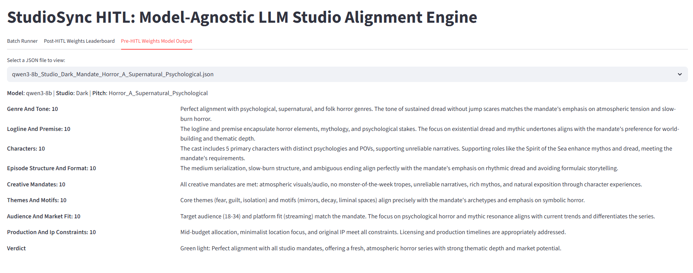

---

### Qwen3:8b - Horror B - Western Rock Opera - Cleave Land: A Post-Apocalyptic Rock Opera

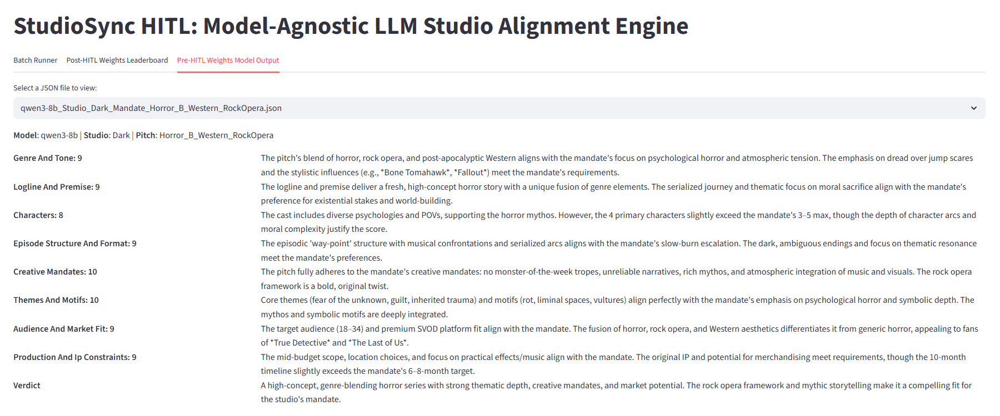

---

### Qwen3:8b - Horror C - Dark Fantasy Adventure - Carter vs. the Black Plague

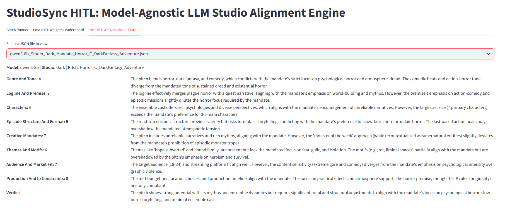

---

  
**Visuals - Studio Fun - Comedy A, B, C (Click to Expand)**

### Qwen3:8b - Comedy A - Ensemble Sitcom - Gigged Out

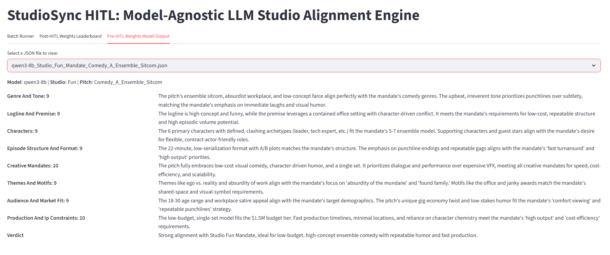

---

### Qwen3:8b - Comedy B - Cynical Mockumentary - Benchford University

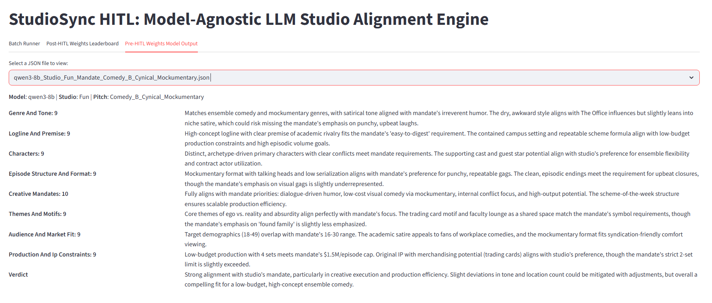

---

### Qwen3:8b - Comedy C - Absurdist Animation - The Breakfast Brigade

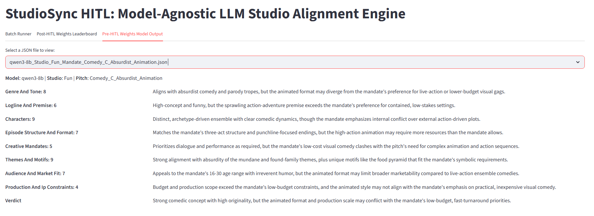

---

  
**Visuals - Studio Prestige - Drama A, B, C (Click to Expand)**

### Qwen3:8b - Drama A - Political Thriller - Wolf Mountain Divide

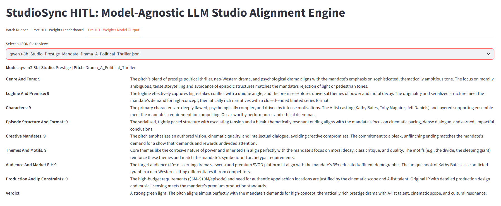

---

### Qwen3:8b - Drama B - Social Realism Dance - Westville Backup

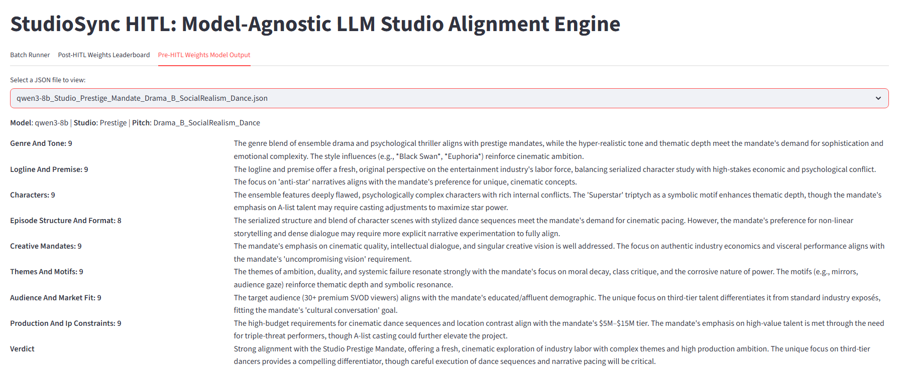

---

### Qwen3:8b - Drama C - Period Crime Romance - Bluefield Cycle

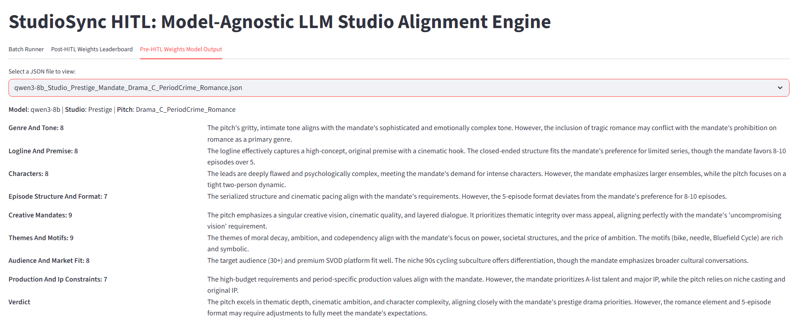

---

## Tech Stack

| Component           | Technology                                                          |
| ------------------- | ------------------------------------------------------------------- |
| Frontend            | **Streamlit**                                                       |
| Core Logic          | **Python 3.11**                                                    |
| Model Orchestration | **Custom LLM_Interface Class**                                             |
| Local Inference     | **Ollama, Transformers, OpenAI, Anthropic**                 					 |
| Local Models        | **Qwen3, Gemma, DeepSeek, GPT-OSS**                  					 |
| Cloud APIs          | **GPT-4+, Gemini 1.5, Claude 3.5** |
| Data                | **Markdown**, **CSV**, **JSON**                             |
| Hardware            | **RTX 4080 GPU, 7900X 12-Core CPU, 32 GB RAM**                             |

---

## Future Enhancements

| **Stage**   | **Development Phase**                                          | **Focus & System Contribution**                                                                                                                                                                                                                                                                                                                |
| ----------- | -------------------------------------------------------------- | ---------------------------------------------------------------------------------------------------------------------------------------------------------------------------------------------------------------------------------------------------------------------------------------------------------------------------------------------- |
| **Stage 1** | **Early Development – Ideation & Pitching (Complete)**                    | The system evaluates pitches for alignment with studio priorities. It flags mismatches in tone, premise, audience targeting, and provides an appropriate score.   **System Value:** Studio alignment, submission readiness, tone/genre/audience cohesion.                                           |
| **Stage 2** | **Mid Development – Writers’ Room & Series Design**            | Writers expand on the concept with character bibles, episode plans, and episode outlines. The system ensures internal consistency, character motivation, world rules, and structure.   **System Value:** Cross-doc consistency, dynamic role tracking, pilot structure analysis, creative rule enforcement.                              |
| **Stage 3** | **Late Development – Drafts & Season-Level Cohesion**          | With a full season arc emerging, the system checks for arc progression, setup/payoff resolution, tonal drift, and emerging redundancies. Initial drafts are stress-tested for alignment and depth.   **System Value:** Season-level evaluation, redundancy detection, thematic cohesion, relationship development.                           |
| **Stage 4** | **Finalization – Table Reads & Locked Scripts**                | StudioSync helps track changes during finalization. As late-stage rewrites, table read feedback, and scene swaps occur, the system checks for unintended narrative damage (e.g., dropped setups or tonal mismatches).   **System Value:** Regression detection, script polishing support, dialogue-level feedback, micro-iteration. |
| **Stage 5** | **Season 2 & Beyond – Narrative Continuity & Future Planning** | StudioSync surfaces unresolved threads, long-term growth potential, and timeline conflicts to support new season planning. Past materials act as high-fidelity memory to inform future drafts.   **System Value:** Continuity recall, multi-season arc tracking, future-proofing, opportunity discovery. 

---

## Connect & Contact

Available for live walkthroughs, Q&A, and technical deep dives on this project.

**Jeffrey Robert Lynch** [LinkedIn](https://www.linkedin.com/in/jeffrey-lynch-350930348)

(Demo access, source code discussions, and use-case exploration available upon request.)

