# StudioSync: LLM Decision Support & Evaluation System

> *This system reflects architectures and methodologies developed in professional engagements. Dataset and use case have been modified for public demonstration.*

## Executive Summary
StudioSync is a **model-agnostic LLM system for structured evaluation and decision support**, designed to score, rank, and route document batches based on alignment with multi-criteria business priorities.  

It enables organizations to:
- **Automate first-pass evaluation** of proposals, documents, or structured inputs  
- **Quantify alignment** with policy, strategy, or operational constraints  
- **Compare model performance** across tasks using structured, reproducible outputs 

Due to the model-agnostic architecture, StudioSync also functions as an automated utility for deriving metrics from A/B tests.

---

## Custom Batch UI - Models x Pitches x Studio Mandates x Adjustable Section Weights

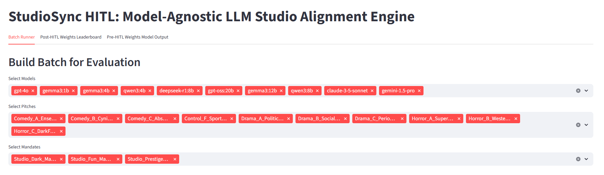

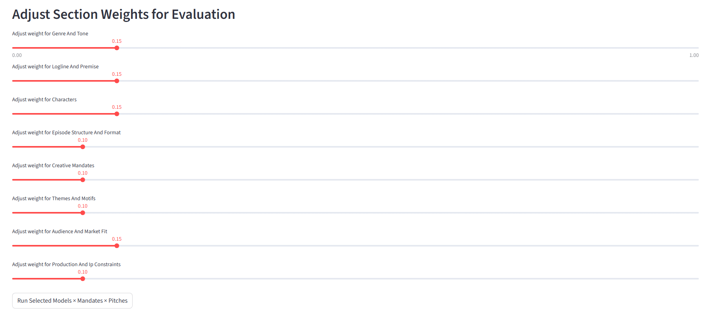

---

## Demo Context

The demo uses a **sanitized dataset of TV show pitches and studio mandates** to simulate a real-world alignment problem. While simplified in size, the dataset is intentionally structured to reflect complex, multi-dimensional evaluation criteria.

A cost-efficient model (Qwen3:8b) is used to demonstrate how **smaller models can perform effectively within well-structured orchestration systems**.

---

## Key Capabilities

- **Model-Agnostic Orchestration:** Supports local (Qwen, Gemma, Llama, DeepSeek) and cloud (GPT, Gemini, Claude) LLMs  
- **Structured Evaluation Framework:** Multi-criteria scoring with deterministic JSON outputs and model-generated rationales  
- **Batch Processing Engine:** Full matrix execution across models, inputs, and scoring configurations  
- **Human-in-the-Loop Control:** Adjustable scoring weights with transparent pre-aggregation outputs  
- **Reproducibility & Tracing:** Run Manager embeds metadata for auditability, experiment tracking, and consistent evaluation  
- **Streamlit Interface:** Interactive UI for ingestion, batch execution, output inspection, and leaderboard generation

---

## System Architecture

- **Batch Evaluation Pipeline:** Ingestion -> Custom Batch -> Batch Inference -> Model Output -> JSON Parsing -> Weight Application -> CSV Parsing -> Leaderboard Display 
- **Robust Output Parsing:** Enforced JSON schema with retry/error handling across models  
- **Auditing:** Raw model outputs preserved prior to weighting for transparency  
- **Tracing:** Metadata embedded across runs for reproducibility and A/B testing  
- **Test Support:** Enables evaluation across variables: counterfactuals, prompt variants, model configs, document structures, etc.  

---

## Applications

Applicable to domains requiring structured evaluation and prioritization, including:

- **Business & Operations:** proposals, marketing, policy evaluation  
- **Regulated Domains:** finance, legal documents, healthcare workflows  
- **Organizational Systems:** internal policies, team composition, resource allocation

---

## Use Case: Document Design

The pitch set consists of **10 high-quality TV show pitches**, carefully designed to isolate alignment with specific mandates rather than overall quality. 

No pitch is "bad", but each is designed to adhere to a **specific genre/sub-genre**. Each is well-defined and many are experimental, odd genre mashups, or niche. This creates **one perfect/near-perfect fit per studio** (A-Tier), **two curve balls per studio** that intentionally violate key studio priorities (B-Tier and C-Tier), and one **universal control pitch** (Control_F) that **strongly misaligns with the business needs of all 3 studios**. 

Each pitch is evaluated across **3 distinct studio mandates** with **highly divergent priorities** and **deviation tolerances**.

---

  
**Studio Mandate Summaries (Click to Expand)**

| Studio     | Base Genre      | Budget Category | Production Timeline | Episode Length | Season Length | Additional Priorities |
| ---------- | --------------- | --------------- | --------------- | ------------ | ------------ | ------------ |
| Studio Dark     | Horror      | Mid             | Mid | Mid | Short | No comedy-horror, slasher, gorefest, monster of the week, or true story human exploitation; Rich world-building & mythology; horror-aligned themes & symbolism |
| Studio Fun      | Comedy       | Low             | Fast | Short | Long | Formulaic episode structure; merchandising opportunities; minimal sets; character-driven humor; repeatable gags; younger audience |
| Studio Prestige | Drama        | High            | Slow | Long | Mid | Open to cross-genre; experimental over formulaic; character depth; cinematic quality; A-list talent required; older audience |

---

**Pitch Summaries (Click to Expand)**

| Pitch Name | Sub-Genre           | Title          | Summary/Logline |
| ---------- | --------------- | ------------- | --------------- |
| Comedy_A   | Ensemble Sitcom | Gigged Out    | Six gig-workers with dubious skills, all strangers, pool their resources to lease a shared office space but are mistaken for a legit consulting firm. **The Office** meets **Three's Company** with more incompetence. |
| Comedy_B   | Cynical Mockumentary | Benchford University  | Six professors at a low prestige university enact schemes to advance their careers while scheming to prevent rivals from advancing their own careers. **Parks & Recreation** meets **A.P. Bio** with a card battling system. |
| Comedy_C   | Absurdist Animation   | The Breakfast Brigade  | The "Breakfast Brigade", an international paramilitary team of anthropomorphic breakfast foods, fight to protect breakfast from the villainous group, "The Process". **G.I. Joe** meets **Archer** with more food puns. |
| Control_F  | Sport Academia        | Grains of Truth: Competitive Sand Counting | A sincere attempt to capture the niche academic sport of competitive sand counting as never seen before on TV. **C-Span** meets **Dry Instructional Films** with coarse, rough, irritating sand that gets everywhere. | 
| Drama_A    | Political Thriller    | Wolf Mountain Divide | A retired city lawyer, now mayor of a remote Appalachian town, reawakens her ambition when a corporation sets their sights on her domain. **Succession** meets **Yellowstone** with Kathy Bates and Toby Maguire. |
| Drama_B    | Social Realism Dance           | Westville Backup | Three third-tier backup dancers support each other while working mundane day jobs, striving for the chance to catch an occasional glimpse of the spotlight. **Fame** meets **Euphoria** with more duality. |
| Drama_C    | Period Crime Romance          | Bluefield Cycle    | In the 90s, a failed competitive cyclist and her mechanic boyfriend embark on a thrilling crime spree, with a predictably tragic resolution. **The Basketball Diaries** meets **Halt and Catch Fire** with cycling crimes. |
| Horror_A   | Supernatural Psychological     | Bastion on the Endless Sea | The crew of a fishing vessel, lost at sea, find themselves adrift in a liminal space where they encounter ghosts of the past and maritime myths. **The Terror** meets **Lost** with descent into maritime madness. |
| Horror_B   | Western Rock Opera        | Cleave Land: A Post-Apocalyptic Rock Opera | Daisy and her companions brave raiders, monsters, and the post-apocalyptic Dust Bowl to reach the fabled Great Lakes and civilization. **Bone Tomahawk** meets **Fallout** with Ferrymen slinging power ballads. |
| Horror_C   | Dark Fantasy Adventure | Carter vs. the Black Plague  | Carter and his band of righteous outlaws defy the odds, and the law, to distribute a cure across a medieval world plagued by monsters and corruption. **Robin Hood** meets **Ash vs. Evil Dead** with a road-trip vibe. |

---

## Use Case: Results

Qwen3:8 performs admirably on this task. Scoring changes slightly across runs, but Qwen3:8b reliably ranks all pitches in order according to their respective genre studio across 10 runs.

- A, B, and C pitches are appropriately ranked relative to each studio's priorities. 
- **Pitch: Control_F_Sport_Academia** is appropriately ranked very low for all three studios.
- Text justifications provide excellent context and **references relevant studio mandate sections specifically**.
- **Objective quantitative metrics** (Budget, Production Timeline, Episode Count, Episode Length, Primary Cast Size, etc.) are **referenced and judged accurately**, with **one minor exception** out of 30 inferences. This could potentially be remedied by revisiting prompt engineering or doc structure.
- **Subjective qualitative metrics** (Sub-Genre, Cross-Genre, Tone, Style Influences, Premise, Themes, etc.) are **referenced and judged accurately**, though not penalized harshly enough in some cases. This could potentially be remedied by revisiting prompt engineering or doc structure.
- Even more interesting, the evaluation of misaligned genre pitches (Comedy Pitch vs Horror Studio Mandate, et al.) is **nuanced and accurate**. Studio Prestige (Drama) and Studio Dark (Horror) have no interest in formulaic comedy pitches, even if well-constructed. **Scoring here is highly appropriate**.
- Likewise, Studio Prestige (Drama) and Studio Dark (Horror) have many **overlapping priorities** (darker tone, strong themes, symbolism, world-building, etc.). It is **perfectly appropriate** that **Pitch: Horror_B_Western_Rock_Opera (an experimental premise with a unique artistic vision)** scores highly with both **Studio Dark** (for horror mythos, originality, world-building, strong themes, budget, etc.) and **Studio Prestige** (for originality, world-building, strong themes, experimental storytelling, unique artistic vision, etc.).
- Further, **Pitch: Horror_C_DarkFantasy_Adventure (a wide genre mashup of horror, adventure, action, fantasy, and comedy)** is the highest-scoring non-comedy pitch with **Studio Fun**. This is also **perfectly appropriate** because this pitch contains the most comedy beats outside of the three dedicated comedy pitches.   

---

## Batch Run & Leaderboard Results - Qwen3:8b - 3 Mandates - 10 Pitches - Default Section Weights

Processing this batch **(1 model x 3 mandate x 10 pitches x default section weights)** takes **~7 minutes** on **modest hardware (single RTX 4080 GPU/16 GB VRAM**). It produces **3 CSV files**, one for each **1 model x 1 mandate x 10 pitch** grouping, for comparative display. It also generates **30 separate JSON files** **(1 model x 1 mandate x 1 pitch)** of raw model scores and text justifications, pre-HITL weighting, for display and full transparency. 

---

  
**Visuals - Batch Builder, HITL Weights, and Leaderboard Results (Click to Expand)**

  
### Batch Builder

Build a batch with any combination of models, mandates, pitches, and section weights.

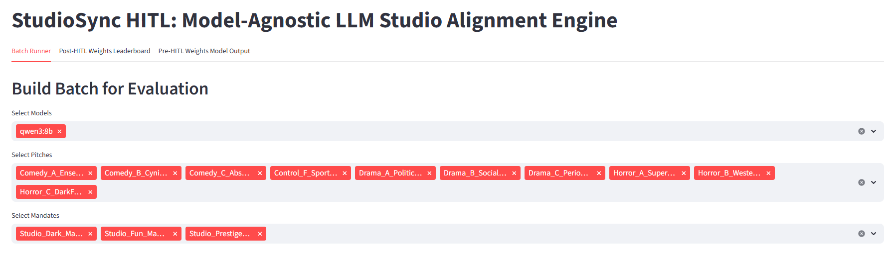

---

### HITL Weights

Fully adjustable section weighting via sliders.

---

### Leaderboard Results

Clear display of pitch rankings for every model x mandate pairing with HITL section weights applied to raw model output.

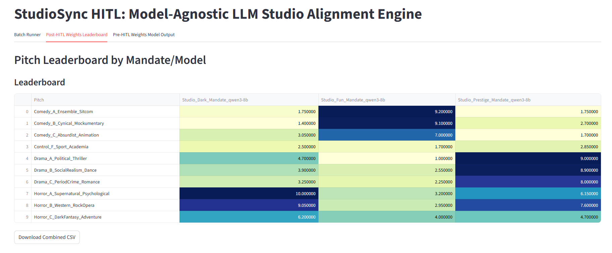

---

## Raw Model Output with Scoring Justification

Raw model output is parsed into JSON and saved before applying HITL weights. These files can be retrieved for easy human-readable display within the dashboard. The default token limit for a model's raw scoring and text justifications is 512 tokens, but this can be adjusted. A smaller token limit can speed up batch processing considerably if the user does not need the section-by-section text justifications. A larger token limit can offer more context for the model's decisions, and allow the model to fully expound on how the pitch aligns or misaligns with each section of the studio mandate.

---

**Visuals - Studio Dark - Horror A, B, C (Click to Expand)**

---

### Qwen3:8b - Horror A - Supernatural Psychological - Bastion on the Endless Sea

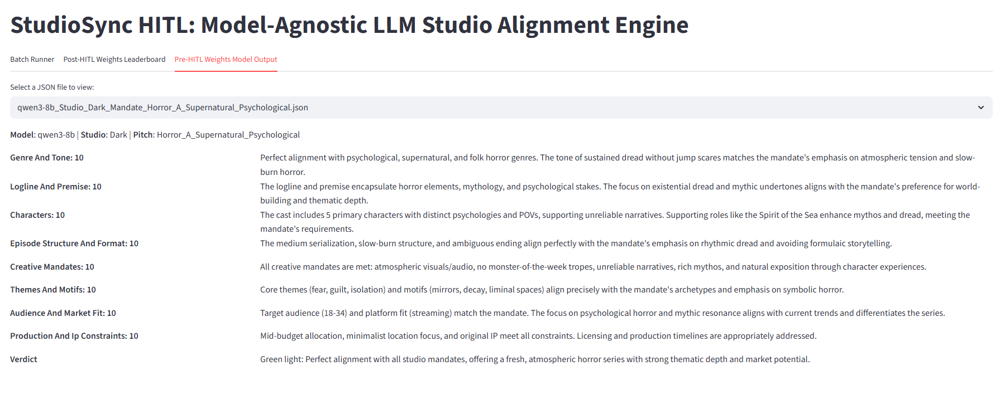

---

### Qwen3:8b - Horror B - Western Rock Opera - Cleave Land: A Post-Apocalyptic Rock Opera

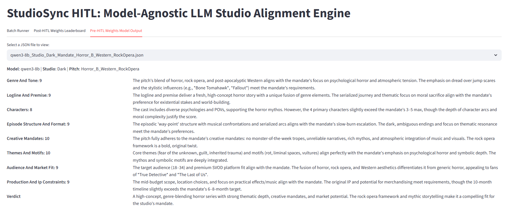

---

### Qwen3:8b - Horror C - Dark Fantasy Adventure - Carter vs. the Black Plague

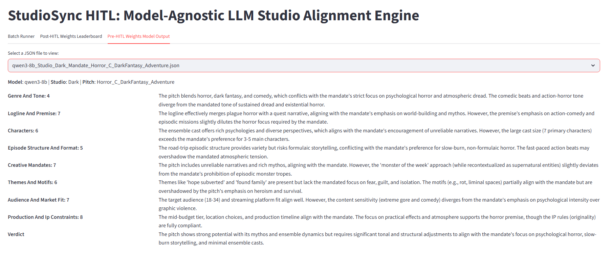

---

  
**Visuals - Studio Fun - Comedy A, B, C (Click to Expand)**

### Qwen3:8b - Comedy A - Ensemble Sitcom - Gigged Out

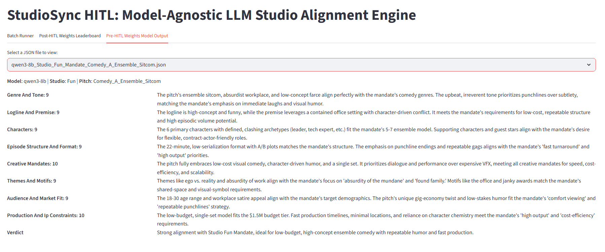

---

### Qwen3:8b - Comedy B - Cynical Mockumentary - Benchford University

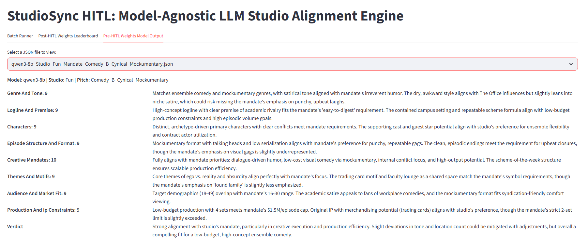

---

### Qwen3:8b - Comedy C - Absurdist Animation - The Breakfast Brigade

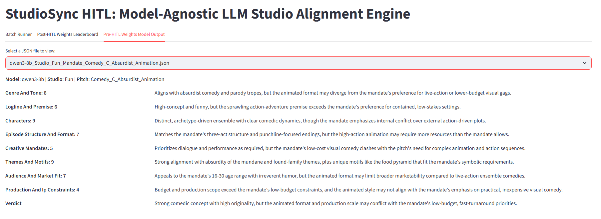

---

  
**Visuals - Studio Prestige - Drama A, B, C (Click to Expand)**

### Qwen3:8b - Drama A - Political Thriller - Wolf Mountain Divide

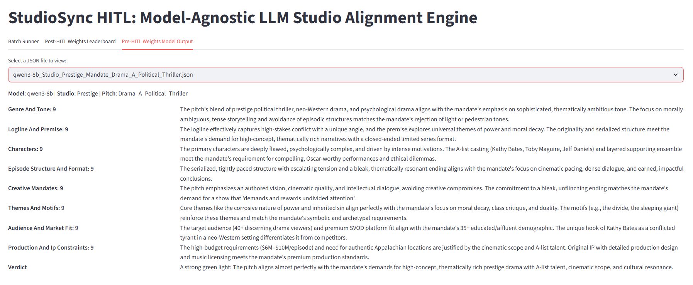

---

### Qwen3:8b - Drama B - Social Realism Dance - Westville Backup

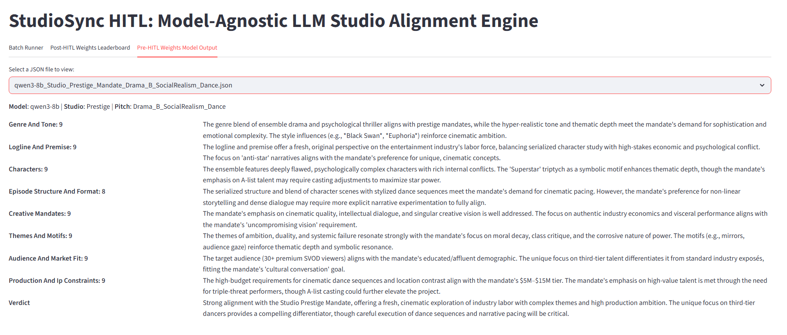

---

### Qwen3:8b - Drama C - Period Crime Romance - Bluefield Cycle

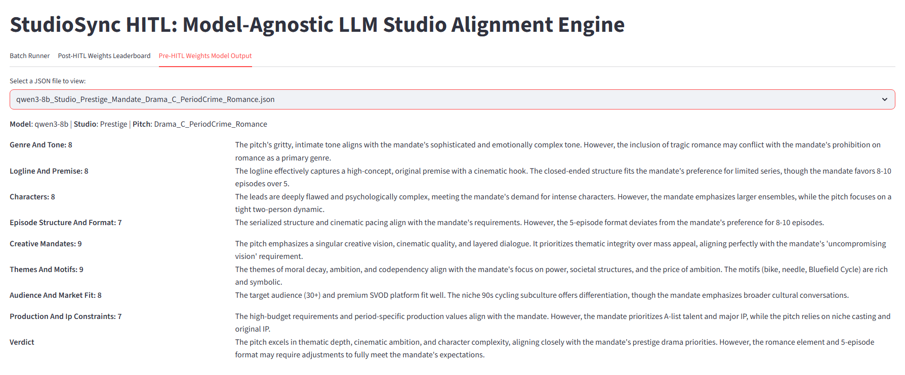

---

## Evaluation Design

The demo dataset consists of **10 high-quality TV show pitches**, each engineered to isolate alignment with specific studio mandates rather than overall quality.

Each pitch targets a distinct genre or sub-genre, including experimental and hybrid combinations. This enables controlled evaluation across:

- **Strong alignment cases (A-tier):** near-perfect fit for a given studio  
- **Partial alignment cases (B/C-tier):** intentional violations of key constraints  
- **Control case:** a deliberately misaligned pitch (Control_F) scoring poorly across all studios  

Each pitch is evaluated against **three distinct studio mandates** with highly divergent priorities, enabling precise analysis of model alignment behavior.

---

  
**Studio Mandate Summaries (Click to Expand)**

| Studio     | Base Genre      | Budget Category | Production Timeline | Episode Length | Season Length | Additional Priorities |
| ---------- | --------------- | --------------- | --------------- | ------------ | ------------ | ------------ |
| Studio Dark     | Horror      | Mid             | Mid | Mid | Short | No comedy-horror, slasher, gorefest, monster of the week, or true story human exploitation; Rich world-building & mythology; horror-aligned themes & symbolism |
| Studio Fun      | Comedy       | Low             | Fast | Short | Long | Formulaic episode structure; merchandising opportunities; minimal sets; character-driven humor; repeatable gags; younger audience |
| Studio Prestige | Drama        | High            | Slow | Long | Mid | Open to cross-genre; experimental over formulaic; character depth; cinematic quality; A-list talent required; older audience |

---

**Pitch Summaries (Click to Expand)**

| Pitch Name | Sub-Genre           | Title          | Summary/Logline |
| ---------- | --------------- | ------------- | --------------- |
| Comedy_A   | Ensemble Sitcom | Gigged Out    | Six gig-workers with dubious skills, all strangers, pool their resources to lease a shared office space but are mistaken for a legit consulting firm. **The Office** meets **Three's Company** with more incompetence. |
| Comedy_B   | Cynical Mockumentary | Benchford University  | Six professors at a low prestige university enact schemes to advance their careers while scheming to prevent rivals from advancing their own careers. **Parks & Recreation** meets **A.P. Bio** with a card battling system. |
| Comedy_C   | Absurdist Animation   | The Breakfast Brigade  | The "Breakfast Brigade", an international paramilitary team of anthropomorphic breakfast foods, fight to protect breakfast from the villainous group, "The Process". **G.I. Joe** meets **Archer** with more food puns. |
| Control_F  | Sport Academia        | Grains of Truth: Competitive Sand Counting | A sincere attempt to capture the niche academic sport of competitive sand counting as never seen before on TV. **C-Span** meets **Dry Instructional Films** with coarse, rough, irritating sand that gets everywhere. | 
| Drama_A    | Political Thriller    | Wolf Mountain Divide | A retired city lawyer, now mayor of a remote Appalachian town, reawakens her ambition when a corporation sets their sights on her domain. **Succession** meets **Yellowstone** with Kathy Bates and Toby Maguire. |
| Drama_B    | Social Realism Dance           | Westville Backup | Three third-tier backup dancers support each other while working mundane day jobs, striving for the chance to catch an occasional glimpse of the spotlight. **Fame** meets **Euphoria** with more duality. |
| Drama_C    | Period Crime Romance          | Bluefield Cycle    | In the 90s, a failed competitive cyclist and her mechanic boyfriend embark on a thrilling crime spree, with a predictably tragic resolution. **The Basketball Diaries** meets **Halt and Catch Fire** with cycling crimes. |
| Horror_A   | Supernatural Psychological     | Bastion on the Endless Sea | The crew of a fishing vessel, lost at sea, find themselves adrift in a liminal space where they encounter ghosts of the past and maritime myths. **The Terror** meets **Lost** with descent into maritime madness. |
| Horror_B   | Western Rock Opera        | Cleave Land: A Post-Apocalyptic Rock Opera | Daisy and her companions brave raiders, monsters, and the post-apocalyptic Dust Bowl to reach the fabled Great Lakes and civilization. **Bone Tomahawk** meets **Fallout** with Ferrymen slinging power ballads. |
| Horror_C   | Dark Fantasy Adventure | Carter vs. the Black Plague  | Carter and his band of righteous outlaws defy the odds, and the law, to distribute a cure across a medieval world plagued by monsters and corruption. **Robin Hood** meets **Ash vs. Evil Dead** with a road-trip vibe. |

---

## Results & Observations

## Results & Observations

Qwen3:8b demonstrates strong performance on this task, with consistent ranking behavior across multiple runs.

### Key Observations

- **Ranking Accuracy:** Pitches are reliably ordered according to studio-specific priorities across repeated runs.  
- **Control Validation:** The intentionally misaligned pitch (Control_F) consistently ranks low across all studios.  
- **Quantitative Reasoning:** Objective metrics (budget, timeline, episode structure, etc.) are evaluated accurately, with only minor edge-case errors. 
- **Qualitative Alignment:** Subjective attributes (genre, tone, themes) are interpreted well, though occasionally under-penalized in edge cases.  
- **Cross-Domain Reasoning:** The model demonstrates nuanced understanding of misaligned genres (e.g., comedy vs. horror mandates), applying appropriate penalties.    
- **Edge Case Behavior:** Hybrid genre pitches are evaluated contextually, with scoring reflecting partial alignment nuance.
- **Overlapping Priority Recognition:** Pitches with shared thematic depth (e.g., horror + prestige drama traits) are correctly scored highly across multiple studios.

### Specific Example

Studio Prestige (Drama) and Studio Dark (Horror) have many **overlapping priorities** (darker tone, strong themes, symbolism, world-building). **Pitch: Horror_B_Western_Rock_Opera**, an experimental cross-genre premise with a unique artistic vision, appropriately scores highly with both: 

- **Studio Dark** for overlapping themes, horror mythos, budget, production timeline
- **Studio Prestige** for overlapping themes, experimental storytelling, unique artistic vision

Similarly, Studio Prestige and Studio Dark consistently score pitches that appeal to Studio Fun very low. Studio Fun prioritizes low budget formulaic comedy with fast production cycles, none of which overlaps with Studio Dark or Studio Prestige priorities.

### Interpretation

These results demonstrate that **structured prompting with deterministic evaluation frameworks enable smaller models to perform reliably on complex alignment tasks**, particularly when evaluation criteria are clearly defined and enforced.

This enables practical use in proposal screening, policy alignment, and decision support workflows where consistent, explainable evaluation is required.

---

## Future Enhancements

- **Enhanced Experiment Tracking:** Extend the Run Manager to capture richer metadata across test runs, enabling more robust benchmarking, comparative analysis, and reproducibility at scale.

- **Run Grouping & Queuing:** Introduce grouped run tracking and execution queues to support large-scale iterative testing, variance analysis, and automated evaluation workflows.

- **A/B Testing Interface:** Expand UI capabilities to natively visualize A/B test results, reducing reliance on manual extraction and improving interpretability of model comparisons.

- **Multi-Tenant RAG Integration (In Progress):**  
  A downstream system is being developed to route high-scoring outputs into a multi-tenant retrieval architecture.  
  - Pitches that meet alignment thresholds pass through a quality gate.  
  - Accepted outputs are embedded into a shared vector database.  
  - Tenant-specific chat interfaces enable querying relevant content based on business context.  

This extends StudioSync from an evaluation system into a **decision-support + knowledge retrieval platform**, supporting downstream workflows and persistent organizational memory. 

---

## Connect & Contact

Available for live walkthroughs, Q&A, and technical deep dives on this project.

**Jeffrey Robert Lynch** [LinkedIn](https://www.linkedin.com/in/jeffrey-lynch-350930348)

(Demo access, source code discussions, and use-case exploration available upon request.)

---

## License

© 2025 Jeffrey Robert Lynch

This project, including all source code, documentation, and related materials, is provided strictly for personal, educational, and portfolio review purposes.

No part of this codebase may be copied, modified, distributed, published, or used for commercial purposes without the author's explicit written permission.

All rights are reserved by the author. No licenses or permissions are granted beyond personal, non-commercial viewing.

